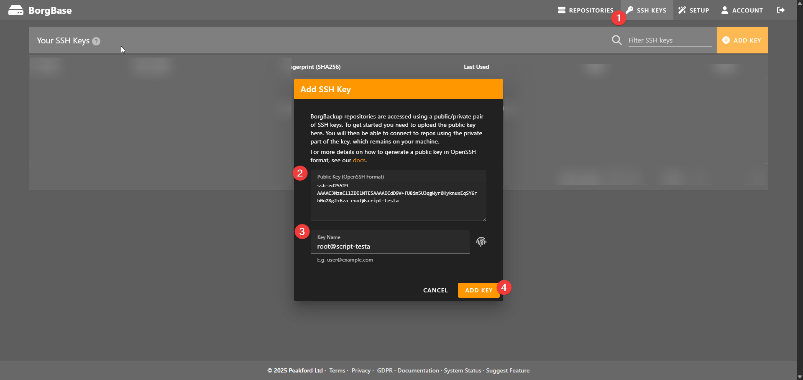
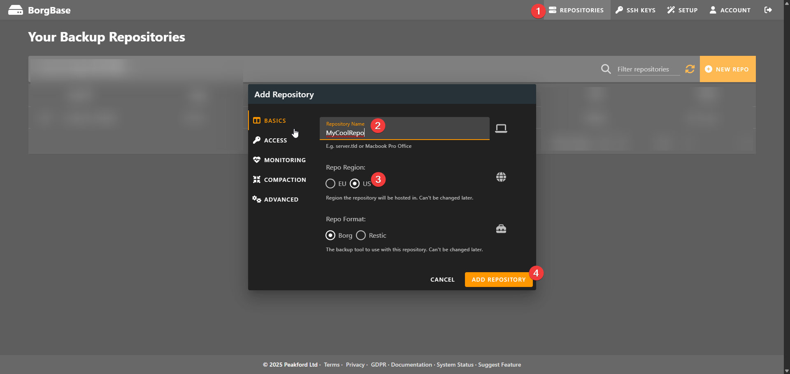
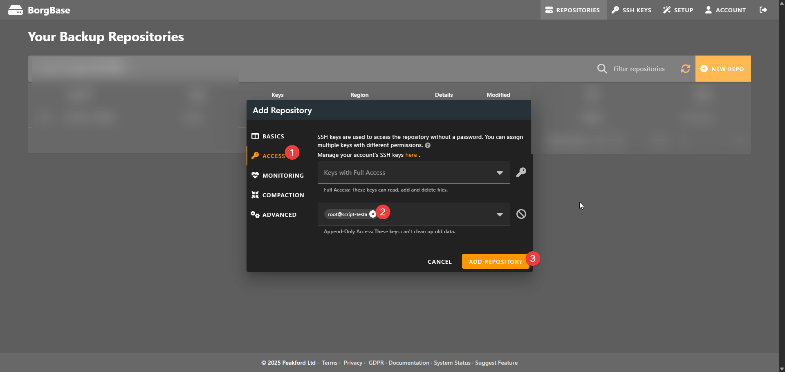
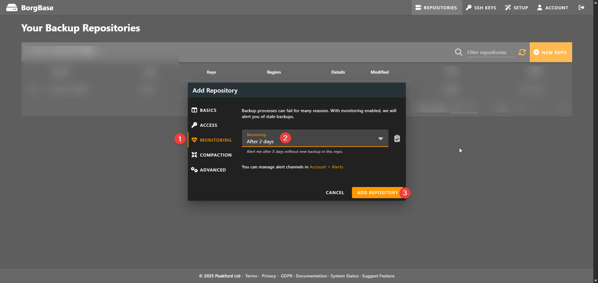
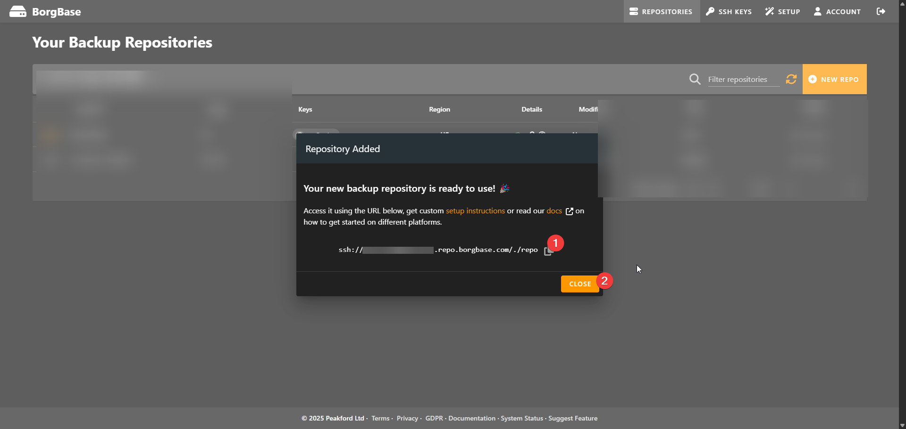

## Before running the script

There are a few things you need to do before running the script if you choose to use BorgBase.

The first one is to generate an SSH key on your server (if you don't already have one) and add it to BorgBase. For this I usually run `ssh-keygen -t ed25519` and then output it using `cat /root/.ssh/id_ed25519.pub` so that I can copy and paste it into the BorgBase interface

Then you want to create a repository. The first step is to set a name and region.

The second step is to setup your SSH Key. I like to use the append-only configuration because it means that my VPS or Dedi can't delete files from Borg, only append. Meaning even in a fully compromised situation I should be fine.

Now you might be telling yourself that this sounds space efficient and this is where compaction comes in. You can trigger server side compaction from the BorgBase UI periodically or manually. I like to do it manually from time to time. What compaction does is it runs the delete commands that the servers sent it (so basically in append-only, the client still tells the server what to delete, it just doesn't until compaction happens)

Next you can setup monitoring, I like to do 2 days. This will email you if the repository hasn't been updated in X days.

The compaction tab would let you enable server-side compaction on a schedule. I don't mess with that since I like to do it manually after I've confirmed my repos are Healthy and not compromised.

The Advanced tab allows you to turn things on like sftp but I've never needed this, so I also skip it. 

I then just hit "Add Repository" and copy the repository URL for use in this script.

The final step is to generate a secure password (I just use 1password) to use as the encryption passphrase. Save this somewhere as you will need it to decrypt the backups and for the script to setup the backups.