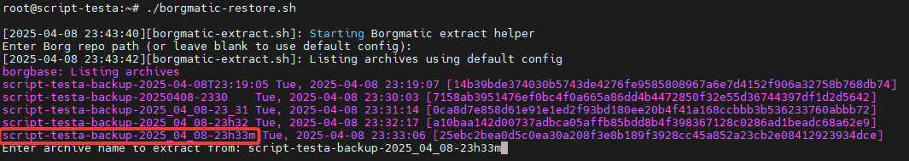

# borgmatic-restore.sh

Run this once you've run [Borgmatic Install](../install) to restore files from a backup. 

When it asks you for an archive, it's looking for this piece of text here (ignore the names above, I was playing with formatting)

And then it will ask you what path to restore. Keep in mind that this is relative to what you backed up. My script by default backs up / (so everything except a few specific directories/files). Which means if I want to restore everything at root, I would enter `root/` (without the leading slash)

After that it will ask you where you want the files. One thing to keep in mind is by default borg will copy over the whole file path there. Meaning if you tell it to extract `root/` to `/root/`, you will get the files at `/root/root/`. Usually I create a temp directory to restore my files to and move them to the right place manually.

**This gives me the control to decide what I want to override or not**